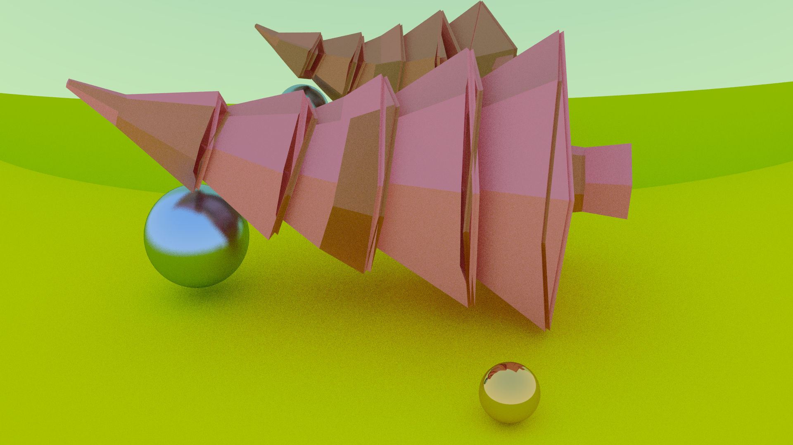

# Simple Ray Tracer

Simple Ray Tracer done following the tutorial "Ray Tracing in One Weekend" by Peter Shirley: https://raytracing.github.io/books/RayTracingInOneWeekend.html

Extended functionality adding mesh drawing with triangles and very simple FBX format reader (only vertices and indices).